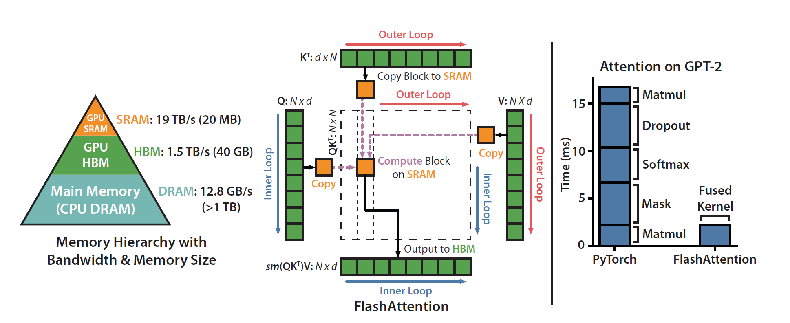
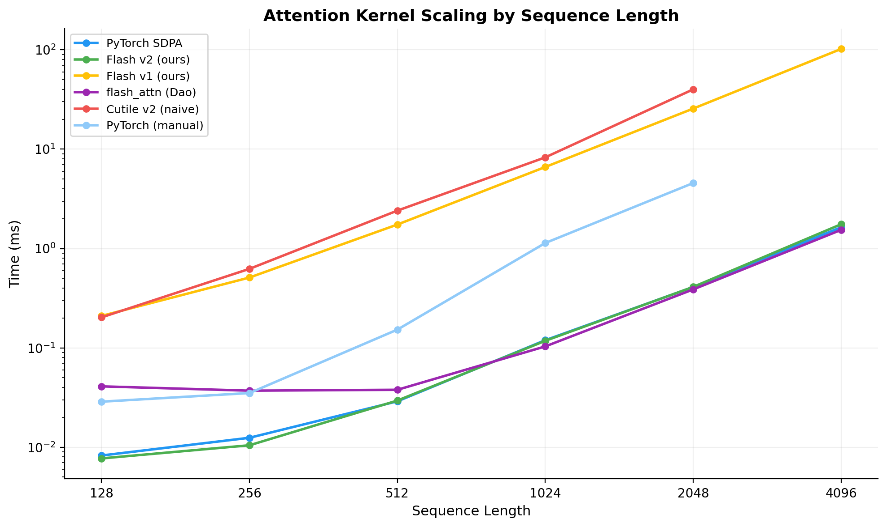

# Learning NVIDIA cuTile by implementing Flash Attention

Implementing Flash Attention from scratch using NVIDIA's cuTile Python DSL, starting from naive kernels and progressing to a production-competitive implementation that matches PyTorch's `scaled_dot_product_attention`.



## What's here

Four self-attention kernels, each building on the last:

1. **Naive v1** - tiles Q rows only, loads full K and V into SRAM
2. **Naive v2** - tiles Q, K, V, materializes score matrix to HBM (5 loops)
3. **Flash Attention v1** - online softmax trick, single loop, no score matrix
4. **Flash Attention v2** - same algorithm + occupancy hints, exp2, fused softmax, latency pipelining, float16 tensor cores, autotuning

The final kernel:

```python
@ct.kernel(occupancy=2)
def cutile_flash_attention_v2_kernel(Q: ct.Array,
                                     K: ct.Array,
                                     V: ct.Array,
                                     qk_scale: float,
                                     SEQ: ct.Constant[int],
                                     HEAD_DIM: ct.Constant[int],
                                     BLOCK_M: ct.Constant[int],
                                     BLOCK_N: ct.Constant[int],
                                     O: ct.Array # output,
                                    ):
    """
    Just an optimized version of the v1 flash attention kernel
    """
    
    batch_idx = ct.bid(0)
    head_idx = ct.bid(1)
    query_row_idx = ct.bid(2)

    q = ct.load(Q, # loading from tensor Q
                (batch_idx, head_idx, query_row_idx, 0), # tile index
                (1, 1, BLOCK_M, HEAD_DIM) # how much to load (1 batch, 1 head, BLOCK_M rows/SEQ, full HEAD_DIM)
                )
    q = ct.reshape(q, (BLOCK_M, HEAD_DIM))  


    # running max
    m = ct.full((BLOCK_M, 1), float("-inf"), dtype=ct.float32)
    # running sum
    l = ct.zeros((BLOCK_M, 1), dtype=ct.float32)
    # output accumulator
    o = ct.zeros((BLOCK_M, HEAD_DIM), dtype=ct.float32)

    # pre-scale for exp2 inside kernel
    qk_scale = qk_scale * INV_LOG_2

    for j in range(ct.cdiv(SEQ, BLOCK_N)):
        # load K transposed at load time via order=(0,1,3,2), no ct.transpose needed
        k_t = ct.load(K,
            (batch_idx, head_idx, 0, j), # note: dim 2 is 0, dim 3 is j (transposed indexing)
            (1, 1, HEAD_DIM, BLOCK_N), # transposed shape
            order=(0, 1, 3, 2),
            latency=2)
        k_t = ct.reshape(k_t, (HEAD_DIM, BLOCK_N))

        v = ct.load(V, # loading from tensor V
            (batch_idx, head_idx, j, 0), # tile index
            (1, 1, BLOCK_N, HEAD_DIM), # how much to load (1 batch, 1 head, BLOCK_N rows/SEQ, full HEAD_DIM)
            latency=4)
        v = ct.reshape(v, ((BLOCK_N, HEAD_DIM)))


        # matmul
        acc = ct.mma(q, k_t, ct.full((BLOCK_M, BLOCK_N), 0.0, dtype=ct.float32))

        # online softmax: maximum of tile
        m_new = max(m, ct.max(acc, axis=-1, keepdims=True) * qk_scale)
        acc = acc * qk_scale - m_new

        # accumulate this tile's contribution
        softmax_numerator_tile = ct.exp2(acc, flush_to_zero=True)
        l_new = ct.sum(softmax_numerator_tile, axis=-1, keepdims=True)
        correction = ct.exp2(m - m_new, flush_to_zero=True)

        # correction factor: rescale previous results to use new max
        l = l * correction + l_new
        o = o * correction

        o = ct.mma(softmax_numerator_tile.astype(Q.dtype), v, o)

        m = m_new

    # normalize by full row sum
    o = ct.truediv(o, l, flush_to_zero=True, rounding_mode=RMd.APPROX)

    ct.store(O, # output mem
             (batch_idx, head_idx, query_row_idx, 0), # tile index
             ct.reshape(ct.astype(o, ct.float16), (1, 1, BLOCK_M, HEAD_DIM)) # cutile array (unsqueezed) and cast back to float16
             )
```

## Results



Our cuTile Flash v2 matches PyTorch SDPA and comes within ~10% of Tri Dao's hand-tuned `flash_attn` implementation across all sequence lengths.

## Requirements

- NVIDIA GPU with CUDA 13.0+ support
- Python 3.12

```bash
pip install -r requirements.txt
```

Versions used in this experiment: `torch==2.11.0`, `cuda-tile==1.2.0`

Optional (for benchmarking against Tri Dao's implementation):
```bash
pip install flash-attn --no-build-isolation  # v2.8.4
```

## Running

```bash
python3 attention.py
```
